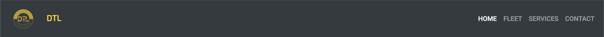

---
# MP1-DTL (USER-CENTRIC FRONTEND DEVELOPMENT MILESTONE PROJECT)

---
## TABLE OF CONTENTS
1. [Project Overview](#project-overview)
    - [Live Site](#live-site)
    - [Repository](#repository)
2. [User Experience (UX)](#user-experience-ux)
    - [Project Goals](#project-goals)
    - [User Stories](#user-stories)
    - [Design](#design)
    - [Wireframes](#wireframes)
3. [Features](#features)
4. [Technologies Used](#technologies-used)
5. [Testing](#testing)
    - [Manual Testing](#manual-testing)
    - [Validation](#validation)
    - [Bugs and Fixes](#bugs-and-fixes)
6. [Deployment](#deployment)
7. [Credits](#credits)
8. [Acknowledgements](#acknowledgements)

---

---
## PROJECT OVERVIEW

Deluxe Transportation is a static front-end website designed to present useful information to users about luxury transportation services. This project was developed as part of the User-Centric Frontend Development Milestone Project. The site is intended to meet both the user's needs and the site owner's goals, providing a clear, professional, and accessible user interface.

### LIVE SITE
**[Live Site](https://mh-likhon.github.io/MP1-DTL/)**

### REPOSITORY
**[Repository](https://github.com/MH-LIKHON/MP1-DTL.git)**

---
## USER EXPERIENCE (UX)

---
### PROJECT GOALS
The goal of this project is to create a responsive, user-friendly website that effectively communicates the services offered by Deluxe Transportation. The website aims to attract potential customers by showcasing the fleet, services, and contact information.

---
### PRE-PROJECT PLANNING

To kick off this project, I evaluated several service-based industries that would benefit from a well-designed, user-centric website. I scored each industry on a set of criteria to determine which would provide the best balance between showcasing my skills and meeting market demands. The criteria were:

- **Portfolio-Weight**: How well the website would represent my capabilities in web development.
- **Complexity**: The complexity of the site features and content.
- **Time to Research**: The amount of time required to understand and implement the content.
- **Revenue Potential**: The potential for generating income by building similar websites for businesses in the industry.

| Type                      | Portfolio-Weight | Complexity | Time to Research | Revenue Potential | Total Score |
|---------------------------|------------------|------------|------------------|-------------------|-------------|
| Luxury Transportation      | 9                | 8          | 7                | 9                 | 33          |
| Event Planning             | 8                | 7          | 6                | 8                 | 29          |
| Small Business Websites    | 9                | 6          | 7                | 8                 | 30          |
| Entertainment Services     | 7                | 6          | 5                | 7                 | 25          |

From this analysis, I chose to create a website for the **Luxury Transportation** industry. This project was ideal for demonstrating a wide range of web development skills, including responsive design, media integration, and user interaction, while also catering to a real-world market need.

---
### SERVICE INDUSTRY RANKING

I also ranked specific services within the transportation industry to identify which would offer the most engaging content and user experience:

| No | Service Type             | Rank |
|----|--------------------------|------|
| 1  | Corporate Travel          | 1    |
| 2  | Airport Transfers         | 2    |
| 3  | Wedding Transportation    | 3    |
| 4  | Event Transportation      | 4    |
| 5  | VIP Services              | 5    |

The focus on **corporate travel** and **airport transfers** reflected the growing demand for these services in the luxury transportation market, making it a good fit for the target audience.

---
### USER STORIES

---
#### NEW USERS
- **As a new user**, I want to easily understand what services the company offers.
- **As a new user**, I want to see high-quality images of the fleet to assess the type of vehicles available.
- **As a new user**, I want to quickly find contact information to inquire about or book a service.

---
#### RETURNING USERS
- **As a returning user**, I want to quickly access the booking options.
- **As a returning user**, I want to find updates or new services being offered.
- **As a returning user**, I want to explore different fleet options for my next booking.

---
#### FREQUENT USERS
- **As a frequent user**, I want to have access to a fast and simple way to contact the company directly for bookings.
- **As a frequent user**, I want the website to be easy to navigate with minimal clicks to get the information I need.

---
#### BUSINESS OWNER
- **As the business owner**, I want to showcase the luxury vehicles in a way that attracts high-end clients.
- **As the business owner**, I want to make it easy for users to inquire about our services and book appointments.
- **As the business owner**, I want to feature client testimonials to build credibility and trust with new visitors.

---
### DESIGN

---
#### COLOUR SCHEME
The design emphasizes a professional look with a modern color palette. I selected:
- **Dark Grey and Black**: To convey luxury and elegance.
- **White**: For clean backgrounds and easy readability.
- **Accent Colors (Gold/Yellow)**: To highlight important elements like buttons and call-to-actions.

---
#### TYPOGRAPHY
Two fonts were chosen to maintain a balance between professionalism and readability:
- **Roboto**: Used for the body text due to its simplicity and legibility.
- **Exo**: Applied to headings and call-to-action areas to give the text a modern and bold feel.

---
#### IMAGERY
High-resolution images of the fleet and service offerings play a crucial role in the design. The imagery is intended to:
- Convey the luxury of the transportation services.
- Create visual engagement that encourages users to explore the services further.
- Maintain a consistent, high-quality aesthetic across the site.

---
### WIREFRAMES

Wireframes were created to map out the layout and structure of the website on various devices (desktop, tablet, and mobile). These wireframes helped ensure a smooth user journey, from discovering the company’s services to contacting them for bookings.

You can view the wireframes here:
- [Home Page Wireframe](assets/wireframes/MP1-DTL_home.bmpr)
- [Fleet Page Wireframe](assets/wireframes/MP1-DTL_fleet.bmpr)
- [Services Page Wireframe](assets/wireframes/MP1-DTL_services.bmpr)
- [Contact Page Wireframe](assets/wireframes/MP1-DTL_contact.bmpr)

---
## FEATURES

---
### EXISTING FEATURES

---
#### HEADER
- The header contains the website’s navigation bar, which includes links to **Home**, **Fleet**, **Services**, and **Contact**.
- The logo in the header is interactive, and clicking on it will always take the user back to the homepage.
- The navigation bar is responsive and collapses into a mobile menu on smaller screens.
- The currently active page is highlighted in the navigation bar for ease of use.


---
#### HOME PAGE
1. **Hero Section**:
    - The homepage features a large hero section with a background video and fallback image for unsupported devices.
    - The hero text and button fade in with smooth animations, drawing attention to the call-to-action.
    - A prominent "Book Now" button leads users to the **Contact** page.
    

2. **Services Section**:
    - A detailed overview of the services offered, accompanied by icons and short descriptions.
    - Each service is presented in a card format, and the layout adjusts to fit any screen size.
    

3. **Client Testimonials**:
    - A testimonials section on the homepage provides customer feedback to build trust and credibility.
    - Testimonials are displayed using cards, and animations ensure they fade in as users scroll down the page.
    

---
#### FLEET PAGE
1. **Fleet Showcase**:
    - The **Fleet** page features a gallery of luxury vehicles available for hire.
    - Each vehicle is showcased with an image, title, and a short description of its features.
    - All vehicle images are responsive, ensuring they maintain a consistent look across different devices.
    

2. **Interactive Vehicle Display**:
    - The vehicles are displayed in a grid format, and users can click on each image for more details.
    - Hover effects are applied to the vehicle images to create an interactive feel when browsing.
    

---
#### SERVICES PAGE
1. **Detailed Services**:
    - The **Services** page provides more in-depth information about each service offered, beyond the brief descriptions on the homepage.
    - Services are grouped into categories for easy navigation, such as **Airport Transfers**, **VIP Services**, and **Corporate Travel**.
    

2. **Icons and Hover Effects**:
    - Each service category is accompanied by a custom icon for visual clarity.
    - Hover effects are applied to icons and buttons to provide visual feedback when the user interacts with the page.
    

---
#### CONTACT PAGE
1. **Multi-Step Contact Form**:
    - The **Contact** page includes a modern, multi-step form where users can input their name, email, phone (optional), and message.
    - The form uses client-side validation for required fields and provides instant feedback if any information is missing.
    

2. **Direct Contact Information**:
    - In addition to the form, the contact page provides users with the company’s phone number, email address, and social media links.
    - Each contact method includes an icon for easy recognition.
    

---
#### FOOTER
- The footer is consistent across all pages and includes links to the company’s social media profiles.
- It also displays the company’s contact information, including phone number and email.
- Copyright information is displayed at the bottom, along with additional navigation links for easy access.
- Hover effects are applied to all social media icons, changing their color and slightly enlarging them when hovered over.


---
### INTERACTIVE FEATURES

1. **Hover Effects**:
    - Hover effects are applied to key elements, including buttons, service icons, and social media links. 
    - Buttons change color and grow slightly when hovered over, providing users with immediate visual feedback.
    

2. **Animated Fade-in Effects**:
    - Smooth animations are applied throughout the site, with elements fading in as users scroll down the page.
    - This adds an interactive and modern feel to the site without overwhelming the user.
    

3. **Call-to-Action Buttons**:
    - Prominent call-to-action buttons throughout the site, directing users to the **Contact** page for bookings or inquiries.
    - The buttons are designed to stand out, with hover effects that enhance user interaction.
    

4. **Mobile-Friendly Design**:
    - The entire site is built with responsiveness in mind, ensuring it looks great on all devices, from desktops to smartphones.
    - Navigation, layout, and images are all optimized for smaller screens.
    

---
### FUTURE FEATURES

1. **Online Booking Form**:
    - An online booking form will allow users to directly schedule services through the website.
    - Users will be able to select their preferred date and time, along with the service they need.

2. **Expanded Testimonials Section**:
    - A rotating carousel feature will be added to the testimonials section, displaying more customer reviews in an engaging format.

3. **Lightbox Gallery for Fleet**:
    - The fleet images will be enhanced with a lightbox gallery, allowing users to click on an image to view a larger version and scroll through the gallery.

4. **Live Chat Feature**:
    - A live chat function will be implemented to provide real-time customer support, allowing users to ask questions or request bookings instantly.

5. **Google Maps Integration**:
    - A Google Maps widget will be added to the contact page, making it easier for users to find the company's location and get directions.

*Please note: Some features may display a "Service Not Enabled" message as this project is a demonstration for the Milestone Project One and does not include full backend functionality.*

---
## TECHNOLOGIES USED
---
### MAIN TECHNOLOGIES
- **HTML5**: For structuring the content of the site.
- **CSS3**: For styling the site.
- **Bootstrap 4.2.1**: For responsive design and layout.
- **FontAwesome**: For icons and visual enhancements.
- **Google Fonts**: For custom typography.

---
### TOOLS
- **Git**: For version control.
- **GitHub Pages**: For deployment.
- **Balsamiq**: For creating wireframes.

---
## TESTING

---
### MANUAL TESTING

The website was manually tested across multiple browsers (Chrome, Firefox, Safari, and Edge) and on different devices (mobile, tablet, desktop) to ensure responsiveness, functionality, and user experience. Below is a detailed overview of the tests conducted and their outcomes.

---
#### TESTING FOR LINKS AND FORMS

| Test                                                    | Outcome |
|---------------------------------------------------------|---------|
| All links in the navigation bar lead to their correct pages | Pass    |
| "Book Now" button in the hero section directs users to the contact page | Pass    |
| Footer social links lead to respective social media pages | Pass    |
| Contact form submits successfully when all fields are filled correctly | Pass    |
| User is prevented from submitting the form without filling in the required fields | Pass    |
| Form validation presents errors when incorrect data types are entered (e.g., email field) | Pass    |

---
#### TESTING FOR RESPONSIVENESS

| Test                                                                 | Outcome |
|----------------------------------------------------------------------|---------|
| The website displays correctly on screens larger than 950px (desktop) | Pass    |
| The website displays correctly on screens smaller than 950px (tablet, mobile) | Pass    |

---
### USER TESTING

---
#### USER TESTING CHALLENGE

5 users were asked to complete specific tasks on the website before receiving any instructions. The tasks and their respective results are listed below.

| Test                                                                                      | Result |
|--------------------------------------------------------------------------------------------|--------|
| Upon arrival, navigate to the **Contact Form** and submit a message | 100%   |
| Locate and access the company's Facebook social media page from the footer                 | 100%   |
| Fill in the contact form and opt-in for promotional offers                                 | 100%   |
| Provide the company's phone number for 24/7 breakdown services                             | 100%   |
| Navigate to the **Fleet** page and count the number of vehicle images                      | 100%   |

---
#### USER RESPONSIVE TESTING

5 users tested the website on mobile devices and/or tablets. Feedback was gathered on any issues related to overlapping content, page layout, or navigation problems.

| Test                  | Result |
|-----------------------|--------|
| Issues Reported       | None   |

---
### GOOGLE LIGHTHOUSE TESTING

Google Lighthouse was used to assess the site's performance, accessibility, best practices, and SEO across all major pages. Below are the results for each page tested.

---
#### `INDEX.HTML`


---
#### `FLEET.HTML`


---
#### `SERVICES.HTML`


---
#### `CONTACT.HTML`


---
### HTML VALIDATION

All HTML pages were validated using the W3C Markup Validation Service to ensure there were no syntax or structural errors.

| Page                 | Validation Results |
|----------------------|--------------------|
| `index.html`         | No Errors          |
| `fleet.html`         | No Errors          |
| `services.html`      | No Errors          |
| `contact.html`       | No Errors          |
| `contact-complete.html` | No Errors      |

---
#### SCREENSHOTS:
- `index.html` Validation Result:
  

- `fleet.html` Validation Result:
  

- `services.html` Validation Result:
  

- `contact.html` Validation Result:
  

---
### CSS VALIDATION

The project's CSS was validated using the W3C CSS Validator to ensure there were no issues with the stylesheet.

| Page                  | Validation Results |
|-----------------------|--------------------|
| `style.css`           | No Errors          |

---
#### SCREENSHOT:
- CSS Validation Result:
  

---
### TESTING SUMMARY

Overall, the website successfully passed all manual and automated tests for navigation, responsiveness, form functionality, and visual elements. No significant issues were reported during user testing, and all validation checks returned no errors.

---
### BUGS AND FIXES

- **Bug 1**: **Navigation bar not collapsing on mobile devices.**
  - **Fix**: Adjusted the Bootstrap classes to ensure the collapse functionality works without JavaScript.

- **Bug 2**: **Footer overlapping content on smaller screens.**
  - **Fix**: Added appropriate padding to ensure the footer stays at the bottom of the page.

- **Bug 3**: **Video background in the hero section not displaying full width.**
  - **Fix**: Used Bootstrap's grid system and CSS adjustments to ensure the video background covers the entire width of the screen across different device sizes.

- **Bug 4**: **Button styling in the hero section not matching the requested yellow color.**
  - **Fix**: Updated the CSS to apply the correct yellow background color (`#f8c146`) and appropriate hover effects to the button.

- **Bug 5**: **"Stay in Touch" text in the footer not properly aligned.**
  - **Fix**: Adjusted the padding and positioning in the CSS to ensure the "Stay in Touch" text and icons have consistent spacing and are properly aligned.

- **Bug 6**: **Hero section video not playing or not fitting correctly.**
  - **Fix**: Reorganized the HTML structure for the hero section, added a full-width container for the video background, and ensured the video is responsive across all device sizes.

- **Bug 7**: **Issues with the hero section video alignment.**
  - **Fix**: Used `object-fit` and Bootstrap's grid system to center the video and ensure it scales correctly while maintaining the desired layout.

- **Bug 8**: **Video background in the hero section positioned incorrectly, sitting in the bottom right corner.**
  - **Fix**: Used `position-absolute`, `top: 50%`, `left: 50%`, and `transform: translate(-50%, -50%)` to center the video and ensure it covers the entire section.

- **Bug 9**: **Hero section video height extending beyond the desired area, affecting the layout.**
  - **Fix**: Removed `height: 100vh;` and ensured the video scales correctly with `object-fit: cover` to maintain the proper aspect ratio.

- **Bug 10**: **"Book Now" button in the hero section not performing the same action as the submit button.**
  - **Fix**: Replaced the `<a>` tag with a `<button>` tag and added `onclick="alert('Service not enabled');"` to trigger the same alert as the submit button.

- **Bug 11**: **Content in the hero section not fading in sequentially.**
  - **Fix**: Added CSS animations using keyframes and `animation-delay` to create a staggered fade-in effect for the `<h1>`, `<p>`, and button elements.

- **Bug 12**: **Buttons not centered or sized appropriately in the contact form.**
  - **Fix**: Used Bootstrap's `d-flex`, `justify-content-center`, and `btn-sm` classes to center the buttons and make them smaller for a better layout.

- **Bug 13**: **During the HTML validation process, a warning was encountered indicating that the document was not mappable to XML 1.0 due to the presence of two consecutive hyphens in comments (e.g., `<!-----Navigation----->`). The warning is related to the way comments are structured with extra hyphens, which conflicts with XML parsing rules.**
  - **Fix**: The comments were updated to be XML-compliant by removing the extra hyphens. For example, the comment `<!-----Navigation----->` was changed to `<!-- Navigation -->`. This ensures that the comments do not interfere with XML processing while still remaining descriptive.

- **Bug 14**: **The HTML validation process flagged an issue with the trailing slashes (`/`) in self-closing tags like `<link />`. While valid in XHTML, trailing slashes are not necessary in HTML5 and can cause issues, especially with unquoted attribute values.**
  - **Fix**: The trailing slashes were removed from the self-closing tags to comply with HTML5 standards. For example, `<link />` was changed to `<link>`. This ensures that the HTML is correctly formatted for HTML5 without any unnecessary elements that could cause validation issues.

- **Bug 15**: **The content cards in the "Welcome to DELUXE TRANSPORTATION" section were displaying with unequal heights, and the padding between the `h2` heading and the cards was insufficient. Additionally, the images inside the cards did not maintain a consistent height, leading to a misaligned layout and visual inconsistency.**
  - **Fix**: Applied Flexbox properties to the card containers to ensure that all cards maintain the same height, regardless of the content within them. CSS was updated to enforce a consistent height for images within the cards. This adjustment ensures that all images are displayed with the same height, further aligning the cards uniformly. Increased the padding between the `h2` heading and the card section to improve spacing and overall layout aesthetics.

- **Bug 16**: **The fleet vehicle images in the "Our Fleet" section were being cropped from both sides due to the `object-fit: cover;` CSS property. This caused important parts of the images to be cut off, leading to a poor visual representation of the vehicles.**
  - **Fix**: The `object-fit` property was changed from `cover` to `contain` for the fleet vehicle images. This adjustment ensures that the entire image is displayed within the card without any cropping, while maintaining the aspect ratio. The `contain` value allows the image to fit within its container, preserving the visual integrity of the vehicle photos.

- **Bug 17**: **Images in index.html were being cropped due to the use of `object-fit: cover` in shared CSS class.**
  - **Fix**: Separated the styling for the images in `index.html` by adding a unique class (`index-card`) to the images on that page. Updated the CSS to use `object-fit: contain` for the `.index-card img` class, ensuring the images maintain their full aspect ratio without cropping, while retaining the `object-fit: cover` setting for images on other pages like `fleet.html`.

- **Bug 18**: **Footer icons (e.g., email, phone, WhatsApp, Facebook) led to 404 error pages when clicked.**
  - **Fix**: Updated the HTML to include an `onclick` event handler for each footer icon. Now, when an icon is clicked, a "Service Not Enabled" alert is displayed instead of leading to a 404 error page. This was achieved by removing the href links and adding `onclick="alert('Service Not Enabled');"` to each anchor tag.

- **Bug 19**: **Fleet vehicle images were being cropped from both sides due to `object-fit: cover`.**
  - **Fix**: Updated the CSS to use `object-fit: contain` instead of `cover` for the fleet vehicle images. This ensures that the entire image is visible without being cropped, providing a better visual representation of the vehicles.

- **Bug 20**: **"Deluxe Transportation" text was not fully visible on mobile.**
  - **Fix**: Added a media query to adjust the `h1` font size for screens with a width of 768px or less. This ensures that the text is fully visible and readable on smaller screens.

- **Bug 21**: **Mobile menu not functioning properly.**
  - **Fix**: The mobile menu issue was resolved by ensuring that the necessary Bootstrap JavaScript components were included and correctly linked. This allows the mobile menu to toggle open and close as intended.

- **Bug 22**: **Button color `#ffcc00` not persisting on click.**
  - **Fix**: Updated the CSS to ensure that the button retains the `#ffcc00` color when clicked and remains consistent throughout the user interaction. This provides a consistent and expected user experience.

- **Bug 23**: **Navigation Bar Issue: "Home" link remains highlighted when navigating to other pages.**
  - **Fix**: The `active` class was manually applied to the corresponding navigation link on each HTML page (`index.html`, `fleet.html`, `services.html`, and `contact.html`). This ensures that the correct page is highlighted when a user navigates to it, providing clear visual feedback about the current page.

---
## DEPLOYMENT

This project was deployed using **GitHub Pages** to host static websites directly from a repository. Below are the detailed steps I followed to deploy the site:

---
### STEPS FOR DEPLOYMENT ON GITHUB PAGES:

1. **Clone the Repository**:
    - First, I cloned the template project (ci-full-template), then renamed it to MP1-DTL and created a repository.

2. **Access the Project Directory**:
    - After cloning the repository, I created a workspace in GitPod and then I navigated into the project folder. Also, I created the necessary filse and folders.

3. **Set up and Push Changes to GitHub**:
    - Any changes made locally were committed and pushed to the main branch.

4. **Deploy to GitHub Pages**:
    - Next, I navigated to the GitHub repository's **Settings** by selecting it from the repository's menu bar.
    - I scrolled down to the **GitHub Pages** section in the Settings sidebar.
    - In the **Source** dropdown menu, I selected the branch I wanted to deploy (`main` branch in this case).
    - I left the `/root` directory as the default option.
    - After clicking **Save**, GitHub began the deployment process.
    
5. **Wait for Deployment**:
    - GitHub sent a notification that the project was being deployed. After about 1-2 minutes, the site went live. I refreshed the page a few times to confirm the deployment status.

6. **Access the Deployed Site**:
    - Once the deployment was completed successfully, the live link to the project was made available in the **GitHub Pages** section of the repository settings.
    - **[Update: Add Deployed Project Link Here]**

---
### RUNNING THE PROJECT LOCALLY:

To run the project on your local machine, follow these steps:

1. **Clone the Repository**:
    - Clone the project repository to your local machine using:
    ```bash
    git clone https://github.com/MH-LIKHON/MP1-DTL.git
    ```

2. **Navigate to the Project Directory**:
    - Move into the project folder by typing:
    ```bash
    cd MP1-DTL
    ```

3. **Open the Project**:
    - Once in the project directory, open the `index.html` file in your browser:
    - On Windows:
      ```bash
      start index.html
      ```
    - On macOS:
      ```bash
      open index.html
      ```
    - On Linux:
      ```bash
      xdg-open index.html
      ```

This will open the website in your browser for local viewing and testing.

---
### GITHUB PAGES BENEFITS:
- **Free Hosting**: GitHub Pages provides free hosting for static sites, which makes it ideal for small to medium projects like this one.
- **Easy Updates**: By simply pushing updates to the `main` branch, the site is redeployed automatically without further configuration.

---
## CREDITS

---
### CONTENT
- The text content was created specifically for the Deluxe Transportation project.

---
### MEDIA
- **Images**: Images were sourced from **Pexels** and **Google Images**. Specific credits:
    - **Vehicle Images**: [Google Photos](https://www.google.com/search?q=vehicle+category+icons&sca_esv=e4392de686f6f47e&sca_upv=1&udm=2&biw=1470&bih=798&sxsrf=ADLYWII-DtPfB9Z6F5AJS5_0i3vFkeYhqQ%3A1724914762416&ei=ShzQZr-NGdqehbIPwdfF-A8&ved=0ahUKEwi_2rmd0JmIAxVaT0EAHcFrEf8Q4dUDCBA&uact=5&oq=vehicle+category+icons&gs_lp=Egxnd3Mtd2l6LXNlcnAiFnZlaGljbGUgY2F0YWdvcnkgaWNvbnNIrjNQpwVY9C1wAngAkAEAmAHGAaABqAmqAQMyLji4AQPIAQD4AQGYAgOgAugCwgIFEAAYgATCAgYQABgHGB7CAggQABgHGAgYHpgDAIgGAZIHAzAuM6AHpQ0&sclient=gws-wiz-serp)
    - **Fleet Image**: [Google Photos](https://www.google.com/imgres?q=luxury%20fleet%20chauffere&imgurl=https%3A%2F%2Fimages.squarespace-cdn.com%2Fcontent%2Fv1%2F654efd4d03812d7a71956efc%2F7860b529-db7b-49e1-ad53-ad5c1f5b2e79%2FBLACKWAZE%2BFLEET%2BOF%2BFIRST%2BCLASS%2BCHAUFFEUR%2BCARS%2B.jpg&imgrefurl=https%3A%2F%2Fwww.blackwaze.co.uk%2F&docid=Q9iOO8CtMBg8VM&tbnid=3mUOOXsRFPW-uM&vet=12ahUKEwj9tKrW0JmIAxXcSkEAHUj6D_8QM3oECGYQAA..i&w=1792&h=1024&hcb=2&ved=2ahUKEwj9tKrW0JmIAxXcSkEAHUj6D_8QM3oECGYQAA)
    - **Service Image**: [Google Photos](https://www.google.com/imgres?q=premium%20services%20chauffere&imgurl=https%3A%2F%2Fwww.nobletransfer.com%2Fupload%2Fuserfiles%2Fimages%2Fnoble-blog-image(3).jpg&imgrefurl=https%3A%2F%2Fwww.nobletransfer.com%2Fblog%2Fstuttgart-airport-transfer-with-premium-limousine-and-chauffer-service-from-noble-transfer%2F&docid=RCL0vxaG_jtZIM&tbnid=C4L4W_xEslG8zM&vet=12ahUKEwiI66720JmIAxUsWEEAHSHYBvkQM3oECHoQAA..i&w=1600&h=1006&hcb=2&ved=2ahUKEwiI66720JmIAxUsWEEAHSHYBvkQM3oECHoQAA)
    - **Contact Image**: [Google Photos](https://www.google.com/search?q=get%20in%20touch&udm=2&tbs=rimg:CSjzhLS2JFOaYXM3cgSjCqu1sgIAwAIA2AIA4AIA&hl=en&sa=X&ved=0CBoQuIIBahcKEwjQlv6005mIAxUAAAAAHQAAAAAQCQ#vhid=oFEqwsXaf7Ax-M&vssid=mosaic)
    - **Videos**: [ShutterStock](https://www.shutterstock.com/video/clip-16780849-4k-big-airplane-landing-dusk)
- **Logo**: The logo was purchased and owned by the project owner.

---
### CODE
- **Bootstrap and FontAwesome**: External libraries used for styling and icons.

---
## ACKNOWLEDGEMENTS
- I would like to thank Manuel, Miguel & Alan for their guidance and support throughout the project.
